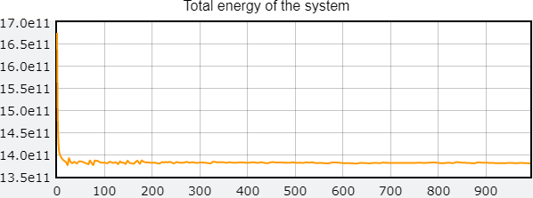

# Молекулярная динамика

Моделирование системы Леннарда-Джонса в ячейке 10х10х10 атомов, с использованием пакетов numpy и vpython.
Система состоит из однородных атомов неона (Ne, *sigma* = 0.272).

## Установка

Версия python - 3.8.2. Используйте менеджер пакетов [pip](https://pip.pypa.io/en/stable/) для инсталяции numpy и vpython.

```bash
pip install numpy
pip install vpython
```
В случае возникновения проблем с vpython, следует установить Build Tools для Visual Studio 2017, либо всю среду сразу.

## Использование
### Подпрограммы
Репозиторий содержит подпрограммы:
```
python cell.py
```
построение ячейки в двух вариантах. Вариант А - расстояние между центрами атомов 0.9 *sigma*, вариант B - 1.2 *sigma*, случайное отклонение - 0.8 *sigma*. При этом радиус атома 0.12 *sigma*.

<span></span>

А также
```
python show.py
```
которая визуализирует атомы, читая их координаты из файла.

### Модели

Первая модель имеет периодические граничные условия (бесконечная среда). Температура равна температуре кипения.
```
python solution.01.py
```
Визуализация


Закон сохранения энергии соблюдается


Вторая модель имеет отражающие стенки
```
python solution.02.py
```
Визуализация


Закон сохранения энергии соблюдается



Пусть при отталкивании от стенки частица приобретает температуру плавления. Энергия падает.


Частица приобретает 1.2 температуру кипения. Энергия растет.


